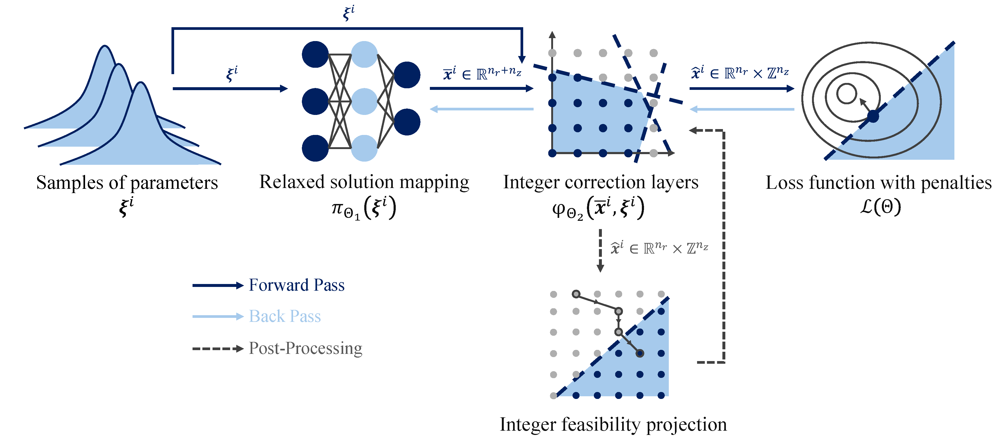

# Learning-to-Optimize for Mixed-Integer Non-Linear Programming

This repository provides the official implementation of our paper: **"[Learning to Optimize for Mixed-Integer Nonlinear Programming](https://arxiv.org/abs/2410.11061)"**



## Overview

Our approach introduces the first general Learning-to-Optimize (L2O) framework designed for Mixed-Integer Nonlinear Programming (MINLP). As illustrated above, the approach consists of two core components: **integer correction layers** and a **feasibility projection heuristic**. Our experiments show that our methods efficiently solve MINLPs with up to tens of thousands of variables, providing high-quality solutions within milliseconds, even for problems where traditional solvers and heuristics fail. 

- We employ a self-supervised learning approach that eliminates the need for labeled data, ensuring scalability and efficiency even for large problem instances.
- We propose computationally efficient learnable correction layers that transform neural network outputs into the integer domain.
- We incorporate a projection step that post-processes an infeasible neural network output by gradient descent towards a feasible integer solution.

## Citation

```
@article{tang2024learning,
  title={Learning to Optimize for Mixed-Integer Non-linear Programming},
  author={Tang, Bo and Khalil, Elias B and Drgo{\v{n}}a, J{\'a}n},
  journal={arXiv preprint arXiv:2410.11061},
  year={2024}
}
```

## Requirements

To run this project, you will need the following libraries and software installed:

- **Python**: The project is developed using Python. Ensure you have Python 3.9 or later installed.
- **Scikit-Learn**: Useful for performing various machine learning tasks.
- **PyTorch**: Used for building and training neural network models.
- **NumPy**: Essential for numerical operations.
- **Pandas**: Useful for data manipulation and analysis.
- **Pyomo**: A Python library for optimization modeling.
- **SCIP**: A powerful solver for mathematical programming, which might need a separate installation process.
- **Neuromancer**: This project uses the Neuromancer library for differentiable programming.

## Code Structure

```
├── archive                        # Archive for older files and documents
├── img                            # Image resources for the project
├── src                            # Main source code directory
│   ├── __init__.py                # Initializes the src package
│   ├── heuristic                  # Modules for the heuristics
│       ├── __init__.py            # Initializes the heuristics submodule
│       ├── rounding.py            # Heuristics for rounding
│       └── resolve.py             # Heuristics for resolving some problem
│   ├── func                       # Directory for function modules
│       ├── __init__.py            # Initializes the function submodule
│       ├── layer.py               # Pre-defined neural network layers
│       ├── ste.py                 # Straight-through estimators for non-differentiable operations
│       ├── rnd.py                 # Modules for differentiable and learnable rounding
│       └── proj.py                # Modules for differentiable and learnable projection
│   ├── postprocess                # Modules for the postprocessing
│       ├── __init__.py            # Initializes the postprocessing submodule
│       └── project.py             # postprocessing for the feasibility projection
│   ├── problem                    # Modules for the benchmark of constrained optimization
│       ├── __init__.py            # Initializes the problem submodule
│       ├── math_solver            # Collection of Predefined SCIP solvers
│           ├── __init__.py        # Initializes the mathematical solver submodule
│           ├── abc_solver.py      # Abstract base class for solver implementations
│           ├── quadratic.py       # SCIP model for Integer Quadratic Problems
│           ├── nonconvex.py       # NeuroMANCER map for Integer Non-Convex Problems
│           └── rosenbrock.py      # SCIP model for Mixed-Intger Rosenbrock Problems
│       └── neuromancer            # Collection of Predefined NeuroMANCER maps
│           ├── __init__.py        # Initializes the NeuroMANCER map submodule
│           ├── quadratic.py       # NeuroMANCER map for Integer Quadratic Problems
│           ├── nonconvex.py       # NeuroMANCER map for Integer Non-Convex Problems
│           └── rosenbrock.py      # NeuroMANCER map for Mixed-Intger Rosenbrock Problems
│   └── utlis                      # Utility tools such as data processing and result test
│       ├── __init__.py            # Initializes the utility submodule
│       └── data.py                # Data processing file
│       └── solve_test.py          # Testing functions to evaluate optimization solution
├── run_qp.py                      # Script to run experiments for Integer Quadratic Problems
├── run_nc.py                      # Script to run experiments for Integer Non-Convex Problems
├── run_rb.py                      # Script to run experiments for Mixed-Integer Rosenbrock Problems
└── README.md                      # README file for the project
```

## Reproducibility

### Integer Quadratic Problems


```Python
python run_qp.py --size 5
```

### Integer Non-Convex Problems

```Python
python run_nc.py --size 5
```

### Mixed-Integer Rosenbrock Problems

```Python
python run_rb.py --size 10
```
